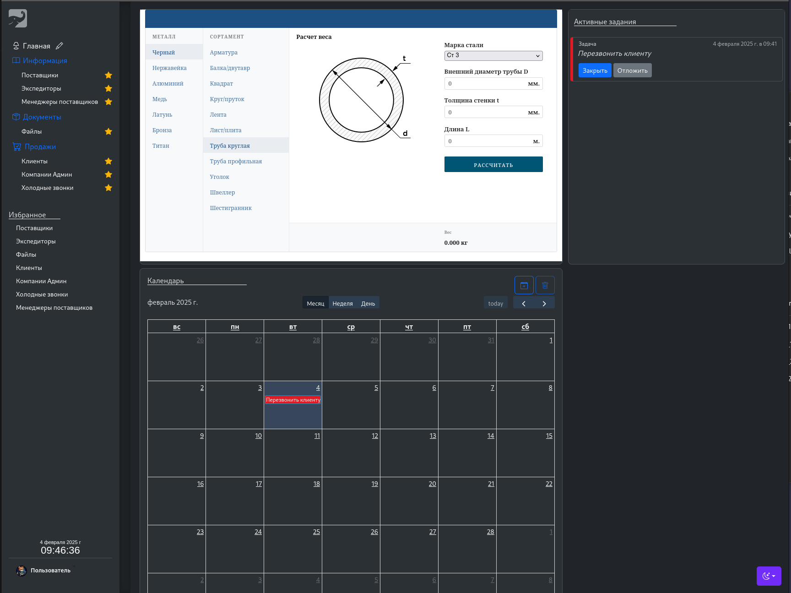

# CRM Project

This repository contains a CRM (Customer Relationship Management) system built with Laravel. It includes modules for managing customers, sales, and tasks.

## screenshot

## Features

- Customer Management: Add, edit, and delete customer information.
- Sales Tracking: Monitor sales progress and customer interactions.
- Task Management: Create and assign tasks to team members.

## Usage

- Navigate to the CRM dashboard.
- Use the menu to manage customers, sales, and tasks.
- View reports and analytics for insights into your CRM data.

## Contributing

Contributions are welcome! Please fork the repository and submit a pull request.

## License

This project is licensed under the MIT License - see the [LICENSE](LICENSE) file for details.
